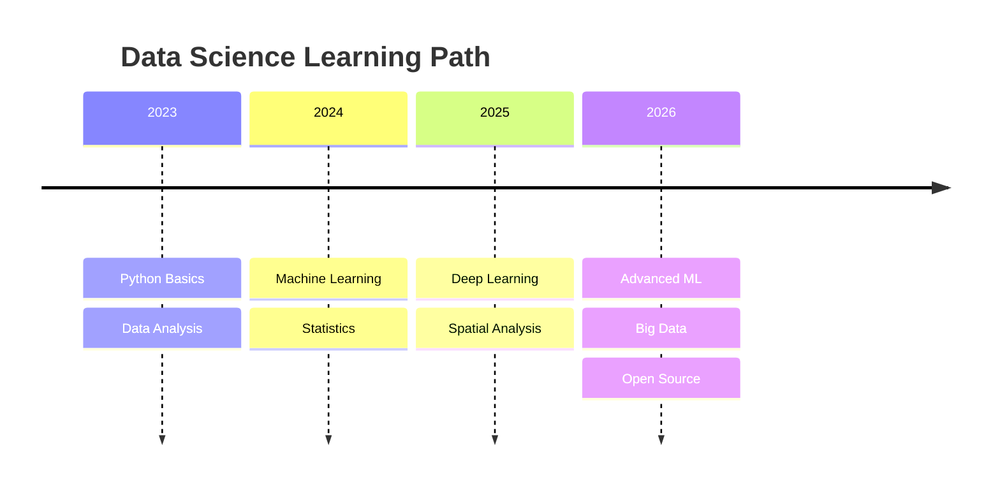

<div align="center">
  
</div>

---

## 💡 **Data Science Wisdom**
> *"Data is not just numbers, it's a story waiting to be told."*  
> — **Rediet Goshu**

---

### 👨‍💻 **About Me**

```python
class DataScientist:
    def __init__(self):
        self.name = "Rediet Goshu"
        self.location = "Ethiopia 🇪🇹"
        self.title = "Aspiring Data Scientist"
        self.philosophy = "Data is not just numbers, it's a story waiting to be told"
        self.interests = ["Machine Learning", "Deep Learning", "Spatial Analysis", "Time Series"]
        self.current_focus = "Building impactful data science projects"
        self.open_to = "Freelance & Remote Opportunities"

    def connect(self):
        print("📫 redietgoshu06@gmail.com")
        print("🔗 linkedin.com/in/rediet-goshu-46a7b736b")
        print("🔗 github.com/redina06")
```

---

### 🛠️ **My Data Science Tech Stack**

| **Category** | **Technologies** |
|:---|:---|
| **📊 Data Analysis** |    |
| **🧠 Machine Learning** |   |
| **📈 Data Visualization** |   |
| **🔬 Scientific Computing** |   |
| **🛠️ Development Tools** |   |

---

### 🚀 **Featured Projects**

| Project | Status | Description |
|:---|:---|:---|
| **[📊 Student Mental Health Analysis](https://github.com/redina06/summer-project-1)** | ✅ Completed | Analyzed lifestyle habits and mental health in students |
| **[🌌 Stellar Data Analysis](https://github.com/redina06/Stellar-Analysis)** | 🔄 In Progress | Exploring patterns in stellar classifications |
| **[🧠 Deep Learning Experiments](https://github.com/redina06/Deep_Learning)** | 🔵 Exploring | Neural network implementations |
| **[🗺️ Spatial Analysis](https://github.com/redina06/Spatial-Analysis)** | 🔄 In Progress | Geospatial data processing |
| **[⏰ Time Series Forecasting](https://github.com/redina06/time_series)** | 🔄 In Progress | Temporal data analysis |

---

### 📊 **GitHub Stats**

<div align="center">
  
  
</div>

<div align="center">
  
</div>

---

### 📈 **Activity Summary**

| Metric | Value |
|:---|:---:|
| ⭐ **Total Stars** | `1` |
| 📝 **Commits (Last Year)** | `37` |
| 🔀 **Pull Requests** | `0` |
| 🐛 **Issues Opened** | `0` |
| 🤝 **Contributions** | `0` |

---

### 🎯 **Current Goals**

- 📚 Master Deep Learning and NLP
- 🏗️ Build end-to-end data science projects
- 🤝 Contribute to open-source
- 💼 Find freelance opportunities
- 🌍 Connect with the data science community

---

### 🗺️ **My Learning Journey**


